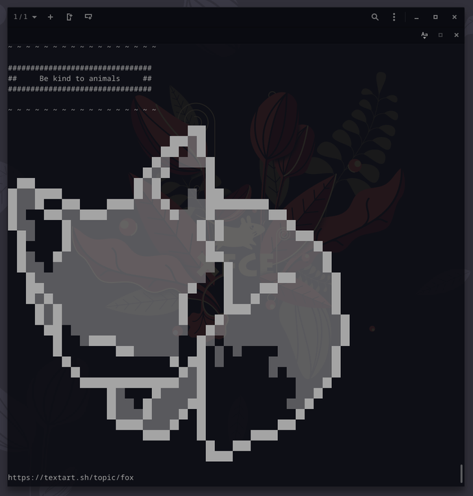

# bash-carnival
Learning bash scripting one step at a time

Following Udemy course ['Learn Bash Quickly: A Hands-on approach to Linux Automation'](https://www.udemy.com/course/learn-bash-quickly/) by Ahmed Alkabary
